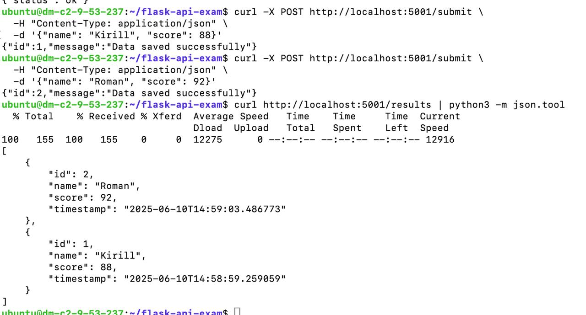

# Отчет по экзаменационной работе: Flask API с CI/CD

**Выполнил:** Метельский Павел  
**Дата выполнения:** 10 июня 2025  
**Сервер:** Ubuntu 24.04.1 LTS (37.9.53.237)

- **Репозиторий с кодом:** https://github.com/PavelMetelsky/HW-lesta/blob/master/Final/report.md
- **Production endpoint:** http://37.9.53.237:5001/results
- **Рабочая директория:** ~/flask-api-exam

## Описание задания

Разработка REST API приложения на Flask с PostgreSQL базой данных и настройка CI/CD pipeline через Jenkins для автоматического развертывания на production сервере.

### Функциональные требования:
- ✅ POST /submit - сохранение данных (name, score) в PostgreSQL
- ✅ GET /results - получение всех записей из БД
- ✅ GET /ping - health check endpoint

## 1. Структура проекта

```
~/flask-api-exam/
├── app/
│   ├── __init__.py       # Инициализация Flask приложения
│   ├── models.py         # Модель данных (Result)
│   └── routes.py         # API endpoints
├── run.py                # Точка входа приложения
├── requirements.txt      # Python зависимости
├── Dockerfile           # Multi-stage сборка
├── docker-compose.yml   # Оркестрация контейнеров
├── .env                 # Переменные окружения
├── .env.example         # Пример переменных
├── Jenkinsfile          # CI/CD pipeline
└── README.md            # Документация
```

## 2. Реализация Flask приложения

### База данных PostgreSQL

**Таблица results:**
| Поле | Тип | Описание |
|------|-----|----------|
| id | INTEGER | Первичный ключ, автоинкремент |
| name | VARCHAR(100) | Имя пользователя |
| score | INTEGER | Количество баллов |
| timestamp | DATETIME | Время создания записи (автоматически) |

### API Endpoints

#### POST /submit
```bash
curl -X POST http://localhost:5001/submit \
  -H "Content-Type: application/json" \
  -d '{"name": "Kirill", "score": 88}'

# Response:
{
  "message": "Data saved successfully",
  "id": 1
}
```

#### GET /ping
```bash
curl http://localhost:5001/ping

# Response:
{"status": "ok"}
```

#### GET /results
```bash
curl http://localhost:5001/results

# Response:
[
  {
    "id": 1,
    "name": "Kirill",
    "score": 88,
    "timestamp": "2025-06-10T10:25:43"
  },
  {
    "id": 2,
    "name": "Roman",
    "score": 92,
    "timestamp": "2025-06-10T10:30:10"
  }
]
```

## 3. Docker конфигурация

### Multi-stage Dockerfile

```dockerfile
FROM python:3.10-slim

# Системные зависимости для PostgreSQL
RUN apt-get update && apt-get install -y \
    gcc python3-dev libpq-dev \
    && rm -rf /var/lib/apt/lists/*

WORKDIR /app
COPY requirements.txt .
RUN pip install --no-cache-dir -r requirements.txt

COPY . .
EXPOSE 5000

# Production сервер Gunicorn
CMD ["gunicorn", "--bind", "0.0.0.0:5000", "--workers", "2", "run:app"]
```

### Docker Compose

- **web**: Flask приложение на порту 5001
- **db**: PostgreSQL 16 Alpine
- **Сети**: изолированная flask-network
- **Volumes**: постоянное хранилище для БД
- **Health checks**: проверка готовности PostgreSQL

## 4. CI/CD Pipeline (Jenkins)

### Стадии pipeline:

1. **Checkout** - клонирование репозитория из Git
2. **Build** - сборка Docker образа приложения
3. **Test/Lint** - проверка кода с помощью flake8
4. **Push** - сохранение образа для деплоя
5. **Deploy** - автоматическое развертывание на production

### Jenkinsfile структура:

```groovy
pipeline {
    agent any
    
    environment {
        DOCKER_IMAGE = 'flask-api-exam'
        REMOTE_HOST = '37.9.53.237'
        REMOTE_USER = 'ubuntu'
        REMOTE_DIR = '/home/ubuntu/flask-api-prod'
    }
    
    stages {
        stage('Checkout') { ... }
        stage('Build') { ... }
        stage('Test/Lint') { ... }
        stage('Push') { ... }
        stage('Deploy') { ... }
    }
}
```

## 5. Развертывание и тестирование

### Локальный запуск:

```bash
cd ~/flask-api-exam
docker-compose up -d

# Проверка статуса
docker-compose ps

# NAME              COMMAND                  SERVICE   STATUS    PORTS
# flask_api         "gunicorn --bind 0..."   web       running   0.0.0.0:5001->5000/tcp
# flask_postgres    "docker-entrypoint..."   db        running   0.0.0.0:5433->5432/tcp
```

### Production деплой:

```bash
./deploy.sh

# Результат:
🚀 Начинаем деплой на production...
📦 Сборка Docker образа...
💾 Сохранение образа...
📁 Создание директории на сервере...
📤 Копирование файлов...
🔄 Развертывание на сервере...
✅ Деплой завершен!
```

### Результаты тестирования API:



## 6. Архитектура решения

```
┌─────────────────┐
│     Client      │
└────────┬────────┘
         │ HTTP/5001
┌────────▼────────┐
│ Ubuntu Server   │
│ 37.9.53.237     │
├─────────────────┤
│ Docker Engine   │
├─────────────────┤
│ ┌─────────────┐ │
│ │  Flask API  │ │ :5001→:5000
│ │  (Gunicorn) │ │
│ └──────┬──────┘ │
│        │        │
│ ┌──────▼──────┐ │
│ │ PostgreSQL  │ │ :5433→:5432
│ │   16 Alpine │ │
│ └─────────────┘ │
└─────────────────┘

CI/CD Pipeline:
GitHub → Jenkins → Build → Test → Deploy → Production
```

## 7. Особенности реализации

1. **Изменение порта**: Использован порт 5001 вместо 5000 из-за конфликта(для домашки 10)
2. **Health checks**: PostgreSQL проверяется перед запуском Flask
3. **Multi-stage build**: Оптимизирован размер Docker образа
4. **Gunicorn**: Production-ready WSGI сервер
5. **Environment variables**: Конфигурация через .env файл
6. **Auto-restart**: Контейнеры перезапускаются при сбое

## Результаты

- ✅ API доступно по адресу: http://37.9.53.237:5001/results