# Отчет по домашнему заданию к лекции 6. DB

**Выполнил:** Метельский Павел
**Дата выполнения:** 5 июня 2025  
**Сервер:** Ubuntu 24.04.1 LTS (37.9.53.237)

**Репозиторий:** https://github.com/PavelMetelsky/HW-lesta/blob/master/hw-DB/report.md

## Характеристики окружения:
- **OS:** Ubuntu 24.04.1 LTS
- **PostgreSQL:** 16.9
- **Sysbench:** 1.0.20
- **Диск:** QEMU HARDDISK 20G (виртуальный HDD)

## Task 1: Install/Restore DB

### Установка необходимого ПО:

```bash
# Обновление репозиториев и установка пакетов
sudo apt update
sudo apt install -y postgresql-16 postgresql-client-16 unzip sysbench
```

### Создание пользователя БД:

```bash
# Создание пользователя ubuntu с правами SUPERUSER
sudo -u postgres psql
CREATE USER ubuntu WITH PASSWORD 'ololo' SUPERUSER;
\q
```

### Загрузка и восстановление дампа:

```bash
# Загрузка файлов с Google Drive
cd ~/db_homework

# Распаковка и восстановление
unzip demo-big.zip
psql postgres < demo-big.sql
```

### Настройка конфигурации PostgreSQL:

```bash
# Изменение параметров через файл конфигурации
sudo nano /etc/postgresql/16/main/postgresql.conf
# shared_buffers = 256MB

# Изменение параметров через консоль
psql postgres
ALTER SYSTEM SET work_mem = '16MB';
SELECT pg_reload_conf();
\q

# Перезапуск сервиса
sudo systemctl restart postgresql
```

### Результаты восстановления:

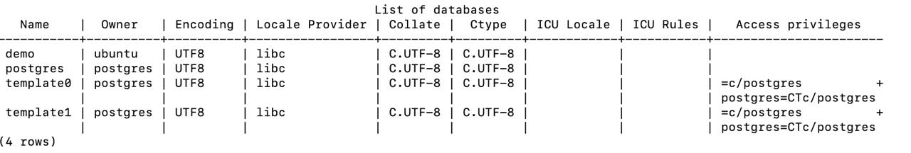

**Таблицы в базе demo (схема bookings):**

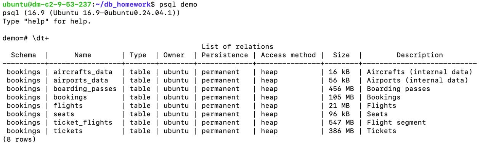

## Task 2: Sysbench

### Проблема при первом запуске:

```bash
sysbench --db-driver=pgsql --pgsql-host=127.0.0.1 --pgsql-db=demo \
  --pgsql-user=ubuntu --pgsql-password=ololo \
  --threads=12 --report-interval=15 --time=30 \
  demo_benchmark.lua run
```

**Ошибка:** `FATAL: sorry, too many clients already`

### Диагностика проблемы:

```sql
SHOW max_connections;  -- Результат: 10
SELECT count(*) FROM pg_stat_activity;  -- Результат: 6
```

### Решение (без изменения параметров sysbench):

```sql
-- Увеличение максимального количества подключений
ALTER SYSTEM SET max_connections = 200;
-- Требуется перезапуск
sudo systemctl restart postgresql
```

### Результат после исправления:

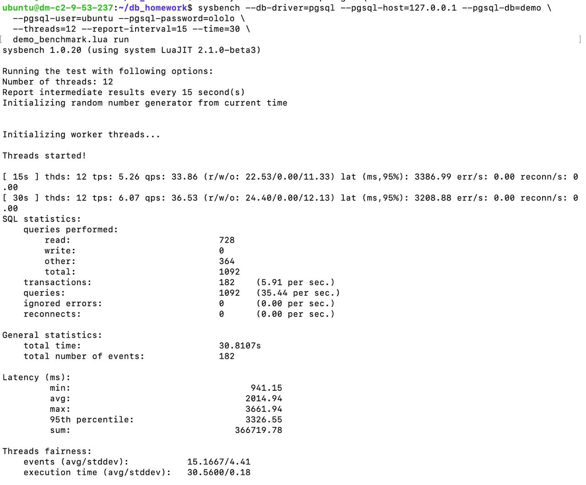

## Task 3: Optimize query

### Анализ запроса ДО оптимизации:

```sql
EXPLAIN ANALYZE SELECT ticket_no, passenger_id, passenger_name 
FROM tickets WHERE book_ref = '521C53';
```

**План выполнения:**
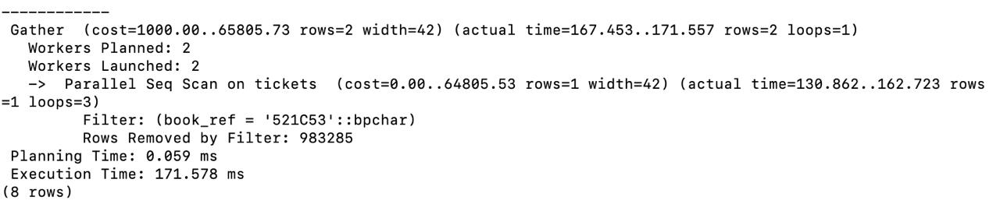

**Проблема:** Отсутствует индекс на поле `book_ref`

### Sysbench ДО оптимизации:

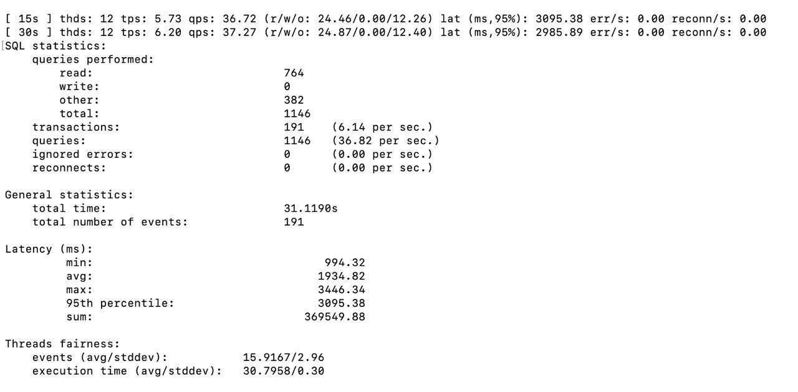

### Оптимизация:

```sql
-- Создание индекса на поле book_ref
CREATE INDEX idx_tickets_book_ref ON tickets(book_ref);
```

### Результат ПОСЛЕ оптимизации:

**План выполнения:**
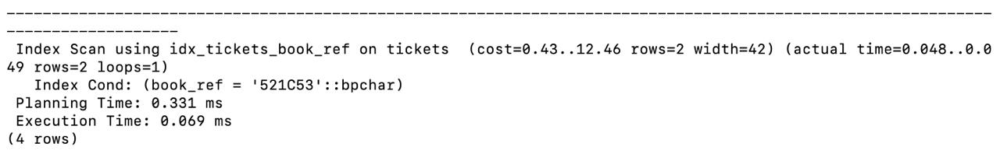

### Sysbench ПОСЛЕ оптимизации:

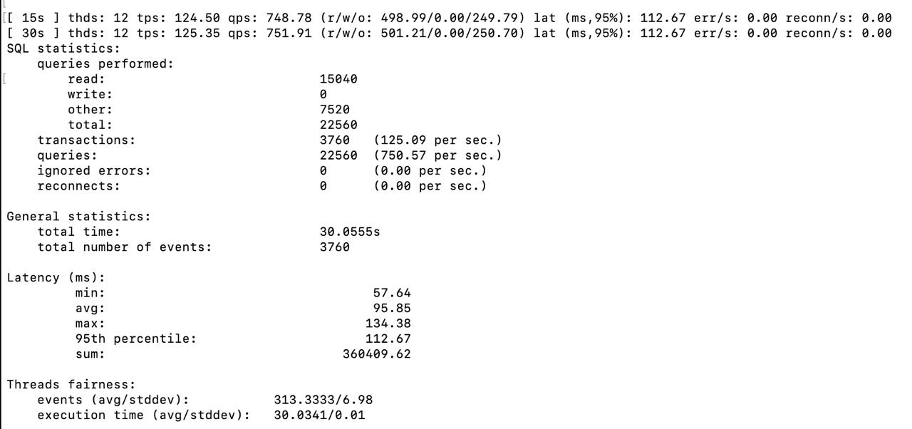

## Task 4: Дополнительная оптимизация

### Анализ запроса с аэропортами:

**Оригинальный запрос (с подзапросом):**
```sql
SELECT a.airport_code as code, a.airport_name, a.city, a.coordinates 
FROM bookings.airports_data a 
WHERE a.city IN (
    SELECT aa.city FROM bookings.airports_data aa 
    GROUP BY aa.city HAVING COUNT(*) > 1
) 
ORDER BY a.city, a.airport_code;
```
Execution Time: **0.353 ms**

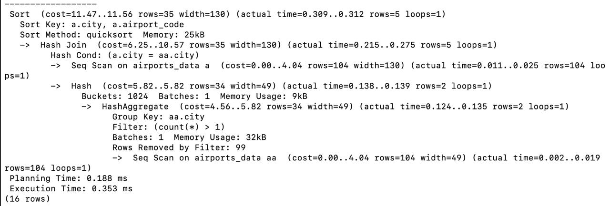

**Оптимизированный запрос (CTE):**
```sql
WITH cities_with_multiple_airports AS (
    SELECT city FROM bookings.airports_data 
    GROUP BY city HAVING COUNT(*) > 1
) 
SELECT a.airport_code as code, a.airport_name, a.city, a.coordinates 
FROM bookings.airports_data a 
JOIN cities_with_multiple_airports c ON a.city = c.city
ORDER BY a.city, a.airport_code;
```
Execution Time: **0.303 ms** (улучшение на 14%)

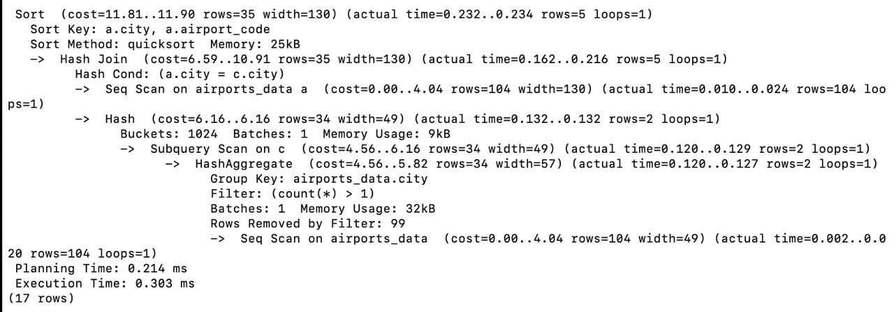

### Обновление demo_benchmark.lua:

### Финальные результаты с обеими оптимизациями:

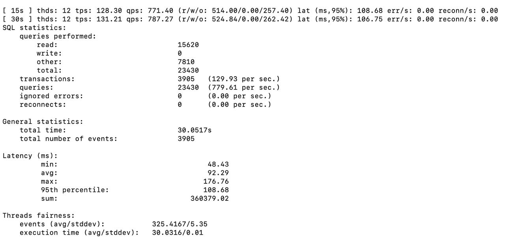

## Дополнительные настройки производительности

### Проверенные параметры:

```sql
-- Увеличение параллельных воркеров
ALTER SYSTEM SET max_parallel_workers_per_gather = 4;
ALTER SYSTEM SET max_parallel_maintenance_workers = 4;

-- Увеличение work_mem
ALTER SYSTEM SET work_mem = '32MB';
```

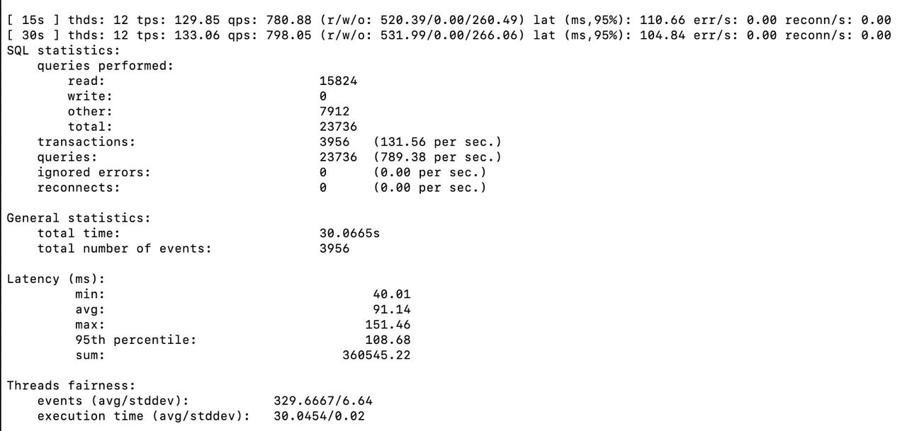

### Настройки для HDD/SSD (не применялись):

**Примечание:** В ходе проверки было установлено, что сервер использует виртуальный HDD (QEMU HARDDISK, ROTA=1). Настройки оптимизации для SSD (random_page_cost = 1.1, effective_io_concurrency = 200) не применялись, так как они могут ухудшить производительность на HDD. В данной конфигурации с виртуальным диском существенного прироста производительности через настройку дисковой подсистемы добиться сложно.

## Итоговое сравнение производительности

### Сводная таблица улучшений:

| Этап | TPS | QPS | Avg Latency | 95% Latency |
|------|-----|-----|-------------|-------------|
| Начальное состояние | 6.14 | 36.82 | 1934.82 мс | 3095.38 мс |
| После индекса на tickets | 125.09 | 750.57 | 95.85 мс | 112.67 мс |
| После оптимизации CTE | 129.93 | 779.61 | 92.29 мс | 108.68 мс |
| **Общее улучшение** | **×21.2** | **×21.2** | **÷21** | **÷28.5** |

### График производительности:

```
TPS (транзакций/сек)
140 ┤                                    ●───●
120 ┤                          ●─────────┘
100 ┤                          │
 80 ┤                          │
 60 ┤                          │
 40 ┤                          │
 20 ┤                          │
  0 ┤●─────────────────────────┘
    └─────────────┬────────────┬────────────┬
         Начало    Индекс     CTE оптим.
```

## Выводы

1. **Основное улучшение** достигнуто за счет создания индекса `idx_tickets_book_ref` - производительность увеличилась в 20+ раз
2. **Дополнительная оптимизация** через переписывание запроса с CTE дала прирост ~4%
3. **Решение проблемы с подключениями** через увеличение `max_connections` позволило запустить sysbench с 12 потоками
4. **Настройки для виртуального окружения** требуют более консервативного подхода, чем для физических серверов
