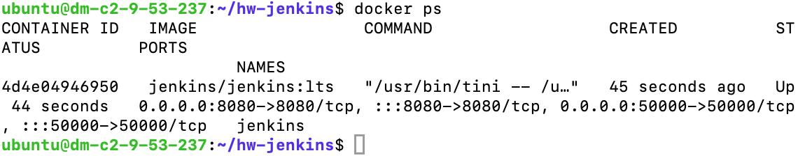
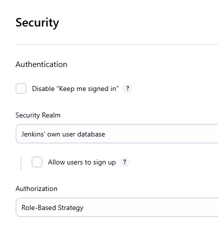
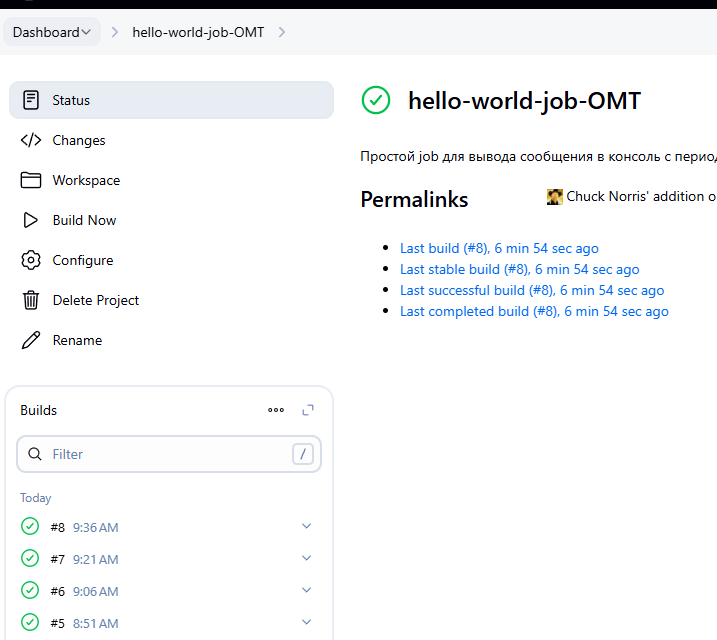
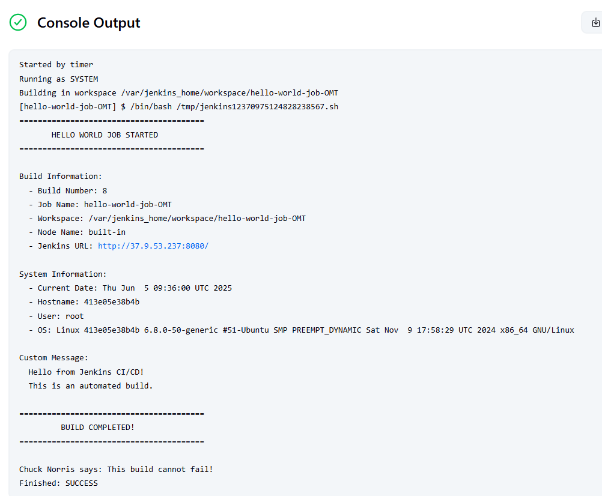
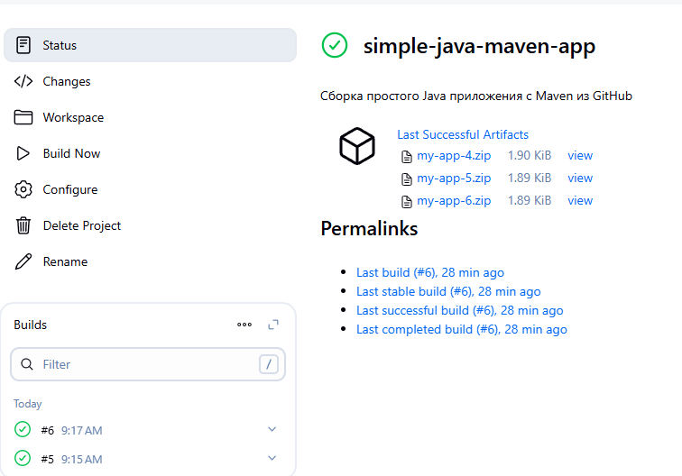

# Отчет по домашнему заданию к лекции 5 CI/CD

**Выполнил:** Метельский Павел
**Дата выполнения:** 5 июня 2025  
**Сервер:** Ubuntu 24.04.1 LTS (37.9.53.237)

- **Репозиторий с конфигами:** https://github.com/PavelMetelsky/HW-lesta/blob/master/hw-Jenkins/report.md
- **Jenkins URL:** http://37.9.53.237:8080 (admin/admin)

## 1. Установка Jenkins с использованием Docker

### Характеристики окружения:
- **OS:** Ubuntu 24.04.1 LTS
- **Docker:** 27.3.1
- **Docker Compose:** v2.29.7
- **Jenkins:** jenkins/jenkins:lts
- **Порты:** 8080 (Jenkins UI), 50000 (агенты)

### Docker Compose конфигурация:

```yaml
version: '3.8'

services:
  jenkins:
    image: jenkins/jenkins:lts
    container_name: jenkins
    user: root
    ports:
      - "8080:8080"
      - "50000:50000"
    volumes:
      - ./jenkins_home:/var/jenkins_home
      - /var/run/docker.sock:/var/run/docker.sock
    restart: unless-stopped
```

### Процесс установки:

```bash
# Создание рабочей директории
mkdir -p ~/hw-jenkins
cd ~/hw-jenkins
mkdir -p jenkins_home

# Создание docker-compose.yml
cat > docker-compose.yml << 'EOF'
version: '3.8'

services:
  jenkins:
    image: jenkins/jenkins:lts
    container_name: jenkins
    user: root
    ports:
      - "8080:8080"
      - "50000:50000"
    volumes:
      - ./jenkins_home:/var/jenkins_home
      - /var/run/docker.sock:/var/run/docker.sock
    restart: unless-stopped
EOF

# Запуск Jenkins
docker-compose up -d

# Ожидание запуска и получение начального пароля
sleep 60
docker exec jenkins cat /var/jenkins_home/secrets/initialAdminPassword
```



## 2. Установка требуемых плагинов

### Установленные плагины:

| Плагин | Описание | Версия | Статус |
|--------|----------|---------|---------|
| Scriptler | Управление и выполнение Groovy скриптов | 334.v29792d5a_c058 | ✅ Установлен |
| Green Balls | Зеленые индикаторы успешных сборок | 1.15.1 | ✅ Установлен |
| ChuckNorris | Цитаты Чака Норриса в сборках | 1.4 | ✅ Установлен |
| Multiple SCMs Plugin | Поддержка нескольких репозиториев | 0.6 | ✅ Установлен |
| Email Extension Plugin | Расширенные email уведомления | 2.103 | ✅ Установлен |
| Role-based Authorization Strategy | Управление доступом через роли | 689.v731678c3e0eb_ | ✅ Установлен |

## 3. Настройка безопасности через Role Strategy Plugin



#### Global roles:

**admin:**
- ✅ Все permissions (полные права администратора)

**anonymous:**
- ❌ Все permissions отключены (нет доступа)

**Результат:** Анонимный доступ полностью отключен. Неавторизованные пользователи перенаправляются на страницу входа.

### Проверка отключения анонимного доступа:

```bash
# Попытка доступа без авторизации
curl -I http://37.9.53.237:8080/
# Результат: HTTP/1.1 403 Forbidden

# Доступ к странице логина
curl http://37.9.53.237:8080/login
# Результат: Страница авторизации
```

## 4. Создание Free-style Job с периодическим запуском


### Параметры Job:

- **Название:** hello-world-job-OMT
- **Тип:** Freestyle project
- **Описание:** Простой job для вывода сообщения в консоль с периодическим запуском

### Build Triggers:

- ✅ **Build periodically**
- **Schedule:** `H/15 * * * *` (каждые 15 минут)

### Build Step (Execute shell):

```bash
#!/bin/bash
echo "========================================"
echo "       HELLO WORLD JOB STARTED          "
echo "========================================"
echo ""
echo "Build Information:"
echo "  - Build Number: ${BUILD_NUMBER}"
echo "  - Job Name: ${JOB_NAME}"
echo "  - Workspace: ${WORKSPACE}"
echo "  - Node Name: ${NODE_NAME}"
echo "  - Jenkins URL: ${JENKINS_URL}"
echo ""
echo "System Information:"
echo "  - Current Date: $(date)"
echo "  - Hostname: $(hostname)"
echo "  - User: $(whoami)"
echo "  - OS: $(uname -a)"
echo ""
echo "Custom Message:"
echo "  Hello from Jenkins CI/CD!"
echo "  This is an automated build."
echo ""
echo "========================================"
echo "         BUILD COMPLETED!               "
echo "========================================"
echo ""
echo "Chuck Norris says: This build cannot fail!"
```

### История сборок:

| Build # | Время запуска | Статус | Триггер |
|---------|---------------|---------|----------|
| #6 | 9:06 AM | ✅ Success | Периодический |
| #5 | 8:51 AM | ✅ Success | Периодический |
### Пример вывода консоли:



## 5. Настройка сборки open-source проекта

### Параметры Job:

- **Название:** simple-java-maven-app
- **Тип:** Freestyle project
- **Описание:** Сборка простого Java приложения с Maven из GitHub

### Source Code Management:

- **SCM:** Git
- **Repository URL:** https://github.com/jenkins-docs/simple-java-maven-app.git
- **Branch Specifier:** */master

### Build Environment:

- ✅ Delete workspace before build starts

### Build Step (Execute shell):

```bash
#!/bin/bash

apt-get update -qq && apt-get install -y maven zip

echo "==="
java -version
mvn --version

echo "==="

mvn clean package -Denforcer.skip=true

echo "=== "
if [ -d "target" ]; then
    zip -j my-app-${BUILD_NUMBER}.zip target/*.jar
    echo "==="
    ls -la *.zip
    unzip -l my-app-${BUILD_NUMBER}.zip
else
    echo "ERROR: target not found!"
    exit 1
fi
```

### Post-build Actions:

- **Archive the artifacts:** `*.zip`

### Результаты сборки:

| Build # | Время | Статус | Размер архива |
|---------|--------|---------|---------------|
| #6 | 9:17 AM | ✅ Success | 1.90 KiB |
| #5 | 9:15 AM | ✅ Success | 1.89 KiB |

### Созданные артефакты:

```
Last Successful Artifacts
├── my-app-4.zip    1.90 KiB    view
├── my-app-5.zip    1.89 KiB    view
└── my-app-6.zip    1.89 KiB    view
```

### Содержимое ZIP архива:

```
Archive:  my-app-6.zip
  Length      Date    Time    Name
---------  ---------- -----   ----
     2885  06-05-2025 09:17   my-app-1.0-SNAPSHOT.jar
---------                     -------
     2885                     1 file
```

## Архитектура решения

```
┌─────────────────┐
│     Client      │
└────────┬────────┘
         │ HTTP/8080
┌────────▼────────┐
│     Jenkins     │
│   (Container)   │
└────────┬────────┘
         │
    ┌────┴────┬────────────┐
    │         │            │
    ▼         ▼            ▼
hello-world  simple-java   Role-based
   job       maven-app     Security
Periodic     GitHub        No Anonymous
Schedule     Maven Build   Access
```
