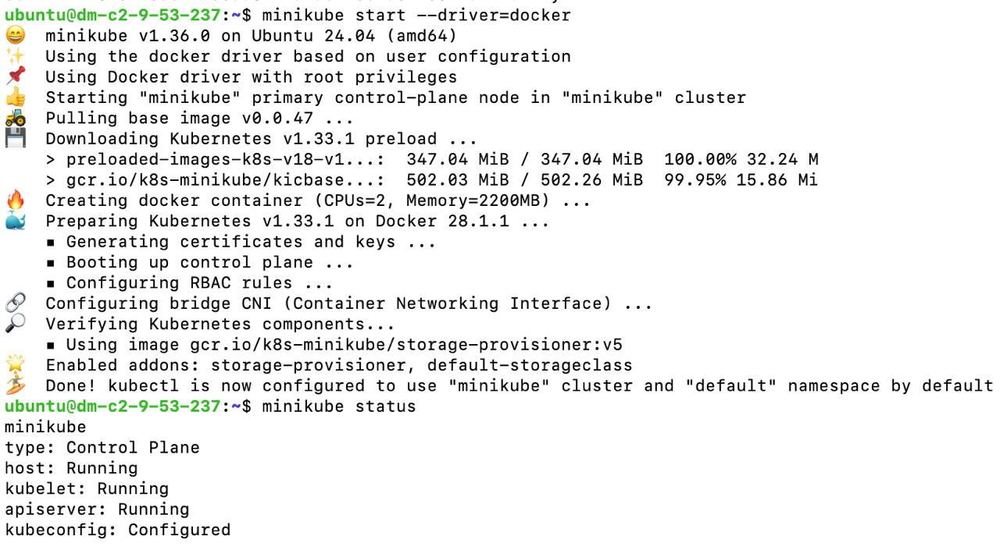
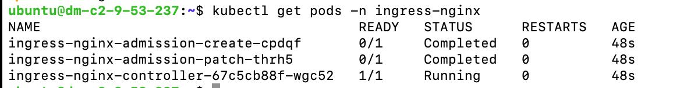
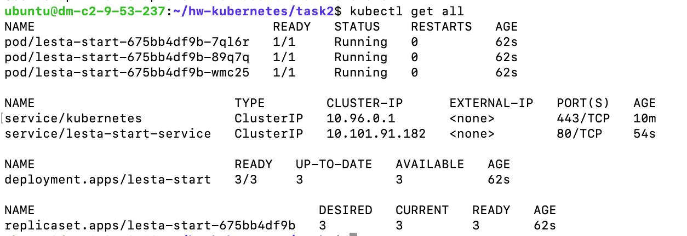
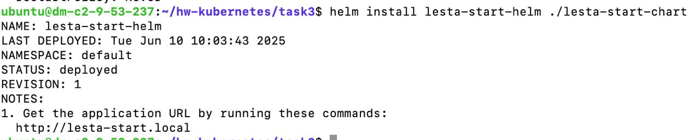
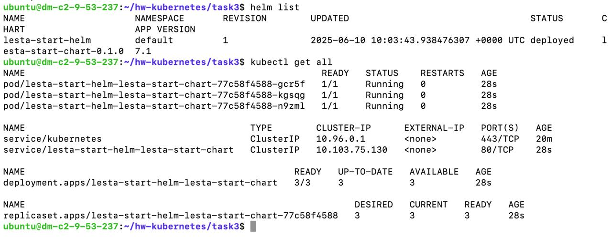
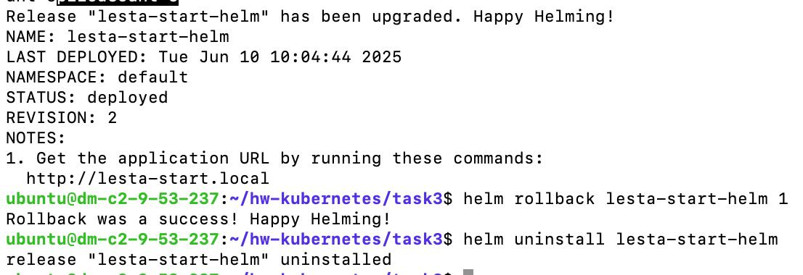

# Отчет по домашнему заданию: Kubernetes

**Выполнил:** Метельский Павел
**Дата выполнения:** 10 июня 2025  
**Сервер:** Ubuntu 24.04.1 LTS

- **Репозиторий с кодом:** https://github.com/PavelMetelsky/HW-lesta/tree/master/hw-Kubernetes
- **Рабочая директория:** ~/hw-kubernetes

## Задание 1: Установка и настройка окружения

### 1.1 Установка kubectl

```bash
# Установка kubectl
curl -LO "https://dl.k8s.io/release/$(curl -L -s https://dl.k8s.io/release/stable.txt)/bin/linux/amd64/kubectl"
sudo install -o root -g root -m 0755 kubectl /usr/local/bin/kubectl

# Проверка версии
kubectl version --client
# Client Version: v1.33.1
```

### 1.2 Установка Minikube

```bash
# Установка Minikube
curl -LO https://storage.googleapis.com/minikube/releases/latest/minikube-linux-amd64
sudo install minikube-linux-amd64 /usr/local/bin/minikube

# Проверка версии
minikube version
# minikube version: v1.36.0
```

### 1.3 Запуск кластера

```bash
# Запуск Minikube с Docker драйвером
minikube start --driver=docker
```



### 1.4 Включение Ingress Controller

```bash
# Включение NGINX Ingress Controller
minikube addons enable ingress
```


## Задание 2: Публикация приложения lesta-start:7.1

### 2.1 Загрузка образа в Minikube

```bash
# Переключение на Docker daemon Minikube
eval $(minikube docker-env)

# Пересборка образа в контексте Minikube
cd ~/hw-docker/task1
docker build -t lesta-start:7.1 .

# Проверка наличия образа
docker images | grep lesta-start
# lesta-start   7.1   xxxxxxxxxxxxx   1 minute ago   12.5MB
```

### 2.2 Deployment манифест

<details>
<summary>~/hw-kubernetes/task2/deployment.yaml</summary>

```yaml
apiVersion: apps/v1
kind: Deployment
metadata:
  name: lesta-start
  labels:
    app: lesta-start
spec:
  replicas: 3
  selector:
    matchLabels:
      app: lesta-start
  template:
    metadata:
      labels:
        app: lesta-start
    spec:
      containers:
      - name: lesta-start
        image: lesta-start:7.1
        imagePullPolicy: Never
        ports:
        - containerPort: 8080
          name: http
        resources:
          requests:
            memory: "64Mi"
            cpu: "100m"
          limits:
            memory: "128Mi"
            cpu: "200m"
        livenessProbe:
          httpGet:
            path: /
            port: 8080
          initialDelaySeconds: 10
          periodSeconds: 10
        readinessProbe:
          httpGet:
            path: /
            port: 8080
          initialDelaySeconds: 5
          periodSeconds: 5
```
</details>

### 2.3 Service манифест

<details>
<summary>~/hw-kubernetes/task2/service.yaml</summary>

```yaml
apiVersion: v1
kind: Service
metadata:
  name: lesta-start-service
  labels:
    app: lesta-start
spec:
  type: ClusterIP
  ports:
  - port: 80
    targetPort: 8080
    protocol: TCP
    name: http
  selector:
    app: lesta-start
```
</details>

### 2.4 Ingress манифест

<details>
<summary>~/hw-kubernetes/task2/ingress.yaml</summary>

```yaml
apiVersion: networking.k8s.io/v1
kind: Ingress
metadata:
  name: lesta-start-ingress
  annotations:
    nginx.ingress.kubernetes.io/rewrite-target: /
spec:
  ingressClassName: nginx
  rules:
  - host: lesta-start.local
    http:
      paths:
      - path: /
        pathType: Prefix
        backend:
          service:
            name: lesta-start-service
            port:
              number: 80
```
</details>

### 2.5 Применение манифестов

```bash
cd ~/hw-kubernetes/task2

# Применение манифестов
kubectl apply -f deployment.yaml
kubectl apply -f service.yaml
kubectl apply -f ingress.yaml
```

# Проверка ресурсов


```bash
# Проверка Ingress
kubectl get ingress
# NAME                  CLASS   HOSTS               ADDRESS        PORTS   AGE
# lesta-start-ingress   nginx   lesta-start.local                   80      45s
```

### 2.6 Тестирование

```bash
# Добавление записи в /etc/hosts
echo "$(minikube ip) lesta-start.local" | sudo tee -a /etc/hosts

# Тестирование через curl
curl http://lesta-start.local
# Hello World!

# Проверка всех реплик
for i in {1..10}; do curl -s http://lesta-start.local; echo; done
# Hello World!
# Hello World!
# ... (10 раз)
```

## Задание 3: Helm Chart

### 3.1 Установка Helm

```bash
# Установка Helm
curl https://raw.githubusercontent.com/helm/helm/main/scripts/get-helm-3 | bash

# Проверка версии
helm version
# version.BuildInfo{Version:"v3.18.2", GitCommit:"xxxxx", GitTreeState:"clean", GoVersion:"go1.24.3"}
```

### 3.2 Создание Helm Chart

```bash
cd ~/hw-kubernetes/task3

# Создание chart
helm create lesta-start-chart

# Структура созданного chart
tree lesta-start-chart/
# lesta-start-chart/
# ├── Chart.yaml
# ├── charts/
# ├── templates/
# │   ├── NOTES.txt
# │   ├── _helpers.tpl
# │   ├── deployment.yaml
# │   ├── hpa.yaml
# │   ├── ingress.yaml
# │   ├── service.yaml
# │   ├── serviceaccount.yaml
# │   └── tests/
# │       └── test-connection.yaml
# └── values.yaml
```

### 3.3 Настройка Chart

<details>
<summary>Chart.yaml</summary>

```yaml
apiVersion: v2
name: lesta-start-chart
description: A Helm chart for lesta-start application
type: application
version: 0.1.0
appVersion: "7.1"
```
</details>

<details>
<summary>values.yaml (основные параметры)</summary>

```yaml
replicaCount: 3

image:
  repository: lesta-start
  pullPolicy: Never
  tag: "7.1"

service:
  type: ClusterIP
  port: 80
  targetPort: 8080

ingress:
  enabled: true
  className: "nginx"
  annotations:
    nginx.ingress.kubernetes.io/rewrite-target: /
  hosts:
    - host: lesta-start.local
      paths:
        - path: /
          pathType: Prefix

resources:
  limits:
    cpu: 200m
    memory: 128Mi
  requests:
    cpu: 100m
    memory: 64Mi

livenessProbe:
  httpGet:
    path: /
    port: 8080
  initialDelaySeconds: 10
  periodSeconds: 10

readinessProbe:
  httpGet:
    path: /
    port: 8080
  initialDelaySeconds: 5
  periodSeconds: 5
```
</details>

### 3.4 Развертывание через Helm

```bash
# Удаление ресурсов, созданных через kubectl
kubectl delete -f ~/hw-kubernetes/task2/

# Проверка шаблонов
helm template ./lesta-start-chart

# Установка chart
helm install lesta-start-helm ./lesta-start-chart
```



# Проверка статуса и ресурсов


### 3.5 Тестирование Helm развертывания

```bash
# Тестирование приложения
curl http://lesta-start.local
# Hello World!

# Обновление values (например, изменение replicas)
helm upgrade lesta-start-helm ./lesta-start-chart --set replicaCount=5

# Откат к предыдущей версии
helm rollback lesta-start-helm 1

# Удаление
helm uninstall lesta-start-helm
```



## Архитектура решения

```
┌──────────────┐
│   Client     │
└──────┬───────┘
       │ HTTP Request
       │ (lesta-start.local)
┌──────▼───────┐
│  Minikube    │
│   Cluster    │
├──────────────┤
│   Ingress    │
│  Controller  │
│   (NGINX)    │
└──────┬───────┘
       │ Route to Service
┌──────▼───────┐
│   Service    │
│(ClusterIP)   │
└──────┬───────┘
       │ Load Balance
┌──────▼───────┐
│  Deployment  │
│ (3 replicas) │
├──────────────┤
│ Pod 1: 8080  │
│ Pod 2: 8080  │
│ Pod 3: 8080  │
└──────────────┘
```

## Основные команды для работы

```bash
# Minikube
minikube start                    # Запуск кластера
minikube stop                     # Остановка кластера
minikube delete                   # Удаление кластера
minikube dashboard                # Web UI для кластера
minikube tunnel                   # Туннель для доступа к LoadBalancer сервисам

# Kubectl
kubectl get all                   # Все ресурсы
kubectl describe pod <pod-name>   # Детальная информация о поде
kubectl logs <pod-name>          # Логи пода
kubectl exec -it <pod-name> -- sh # Вход в под

# Helm
helm install <name> <chart>       # Установка chart
helm upgrade <name> <chart>       # Обновление
helm rollback <name> <revision>   # Откат
helm list                         # Список релизов
helm uninstall <name>            # Удаление
```