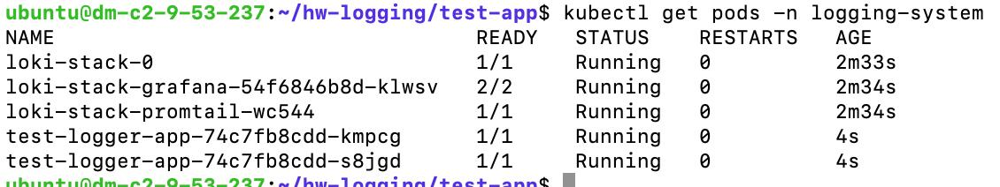
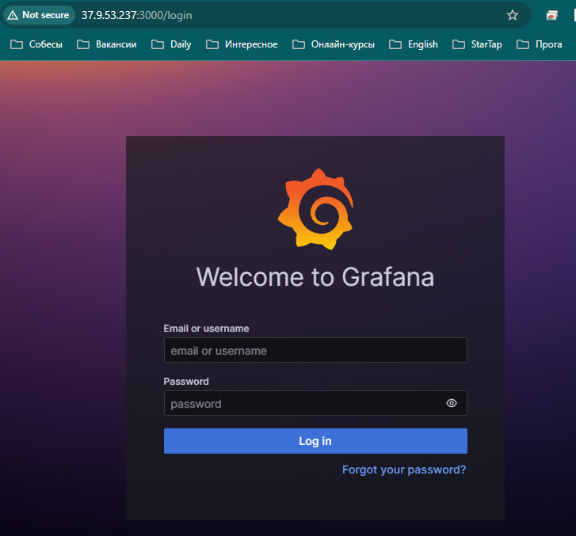
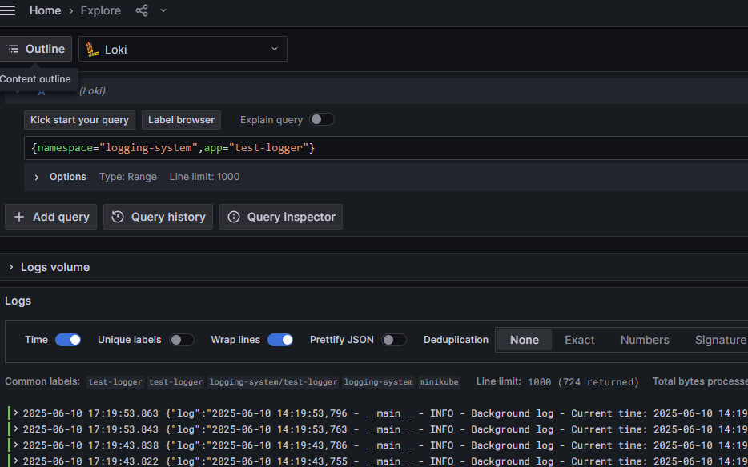
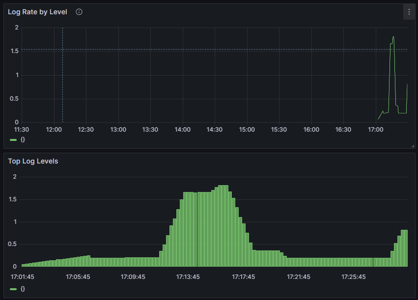
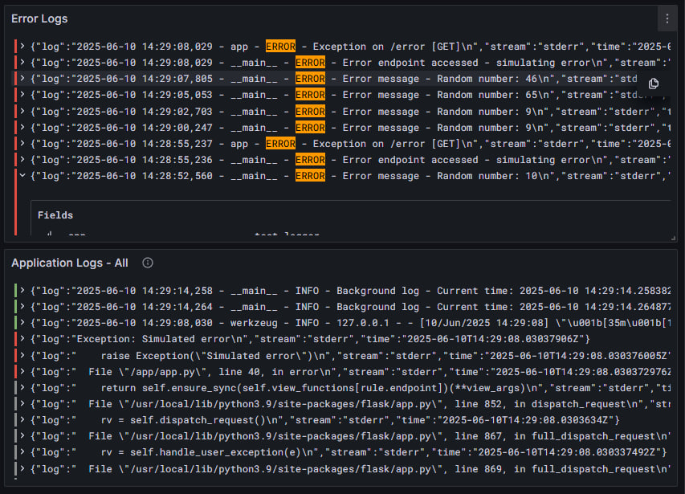

# Отчет по домашнему заданию к лекции 10. Logging

**Выполнил:** Метельский Павел  
**Дата выполнения:** 10 июня 2025  
**Сервер:** Ubuntu 24.04.1 LTS (37.9.53.237)

- **Репозиторий с кодом:** https://github.com/PavelMetelsky/HW-lesta/tree/master/hw-Logging
- **Рабочая директория:** ~/hw-logging

## Задание: Развертывание системы логирования на основе Loki, Promtail и Grafana

### 1. Подготовка окружения

#### 1.1 Запуск Minikube

```bash
# Проверка доступной памяти
free -h

# Запуск с оптимальными параметрами для сервера
minikube start --driver=docker --memory=2048 --cpus=2
```

#### 1.2 Создание namespace

```bash
# Создание отдельного namespace для системы логирования
kubectl create namespace logging-system
```

### 2. Установка Loki Stack

#### 2.1 Добавление Helm репозитория

```bash
# Добавление официального репозитория Grafana
helm repo add grafana https://grafana.github.io/helm-charts
helm repo update
```

#### 2.2 Установка компонентов

```bash
# Установка Loki Stack с включенными Grafana и Promtail
helm install loki-stack grafana/loki-stack \
  --namespace logging-system \
  --set grafana.enabled=true \
  --set prometheus.enabled=false \
  --set promtail.enabled=true \
  --set loki.persistence.enabled=false
```

### 3. Создание тестового приложения

#### 3.1 Структура приложения

```
~/hw-logging/test-app/
├── app.py
├── requirements.txt
├── Dockerfile
└── deployment.yaml
```

#### 3.2 Python приложение с генерацией логов

<details>
<summary>app.py</summary>

```python
from flask import Flask
import logging
import time
import random
from datetime import datetime

app = Flask(__name__)

# Настройка логирования
logging.basicConfig(
    level=logging.INFO,
    format='%(asctime)s - %(name)s - %(levelname)s - %(message)s'
)
logger = logging.getLogger(__name__)

@app.route('/')
def index():
    logger.info("Index page accessed")
    return "Test Application for Logging"

@app.route('/generate')
def generate_logs():
    levels = [
        (logger.info, "Info message"),
        (logger.warning, "Warning message"),
        (logger.error, "Error message"),
        (logger.debug, "Debug message")
    ]
    
    for _ in range(5):
        log_func, msg = random.choice(levels)
        log_func(f"{msg} - Random number: {random.randint(1, 100)}")
        time.sleep(0.1)
    
    return "Logs generated!"

@app.route('/error')
def error():
    logger.error("Error endpoint accessed - simulating error")
    raise Exception("Simulated error")

if __name__ == '__main__':
    # Генерация логов каждые 10 секунд
    import threading
    
    def background_logs():
        while True:
            logger.info(f"Background log - Current time: {datetime.now()}")
            time.sleep(10)
    
    thread = threading.Thread(target=background_logs)
    thread.daemon = True
    thread.start()
    
    app.run(host='0.0.0.0', port=5000)
```
</details>

#### 3.3 Dockerfile для приложения

<details>
<summary>Dockerfile</summary>

```dockerfile
FROM python:3.9-slim

WORKDIR /app

COPY requirements.txt .
RUN pip install -r requirements.txt

COPY app.py .

EXPOSE 5000

CMD ["python", "app.py"]
```
</details>

#### 3.4 Kubernetes манифесты

<details>
<summary>deployment.yaml</summary>

```yaml
apiVersion: apps/v1
kind: Deployment
metadata:
  name: test-logger-app
  namespace: logging-system
  labels:
    app: test-logger
spec:
  replicas: 2
  selector:
    matchLabels:
      app: test-logger
  template:
    metadata:
      labels:
        app: test-logger
    spec:
      containers:
      - name: test-logger
        image: test-logger-app:1.0
        imagePullPolicy: Never
        ports:
        - containerPort: 5000
---
apiVersion: v1
kind: Service
metadata:
  name: test-logger-service
  namespace: logging-system
spec:
  selector:
    app: test-logger
  ports:
  - port: 80
    targetPort: 5000
```
</details>

### 4. Развертывание приложения

```bash
# Использование Docker daemon из Minikube
eval $(minikube docker-env)

# Сборка образа
docker build -t test-logger-app:1.0 .

# Применение манифестов
kubectl apply -f deployment.yaml

# Проверка статуса
kubectl get pods -n logging-system
```



### 5. Настройка доступа

#### 5.1 Получение пароля Grafana

```bash
kubectl get secret --namespace logging-system loki-stack-grafana \
  -o jsonpath="{.data.admin-password}" | base64 --decode ; echo
# Результат: 0ELgYrhRNJob0QUgMQFdHlFX3EIu6W9JlmRPFO8e
```

#### 5.2 Настройка внешнего доступа

```bash
# Настройка firewall
sudo ufw allow 3000/tcp
sudo ufw allow 5000/tcp

# Port-forwarding с доступом извне
nohup kubectl port-forward --namespace logging-system \
  --address 0.0.0.0 service/loki-stack-grafana 3000:80 > /tmp/grafana-forward.log 2>&1 &

nohup kubectl port-forward --namespace logging-system \
  --address 0.0.0.0 service/test-logger-service 5000:80 > /tmp/app-forward.log 2>&1 &
```

### 6. Проверка системы логирования

#### 6.1 Генерация тестовых логов

```bash
# Генерация различных типов логов
for i in {1..10}; do
  curl http://localhost:5000/
  curl http://localhost:5000/generate
  sleep 1
done

# Генерация ошибок
curl http://localhost:5000/error || true
```

#### 6.2 Настройка Grafana



**Доступ к Grafana:**
- URL: http://37.9.53.237:3000
- Login: admin
- Password: 0ELgYrhRNJob0QUgMQFdHlFX3EIu6W9JlmRPFO8e

**Просмотр логов через Explore:**
1. Переход в раздел Explore
2. Выбор Loki как data source
3. Использование запроса: `{namespace="logging-system",app="test-logger"}`



### 7. Создание Dashboard

#### 7.1 Структура Dashboard

Создан dashboard "Test Application Monitoring" с тремя панелями:

1. **Application Logs - All**
   - Запрос: `{namespace="logging-system",app="test-logger"}`
   - Тип визуализации: Logs
   - Показывает все логи приложения

2. **Error Logs**
   - Запрос: `{namespace="logging-system",app="test-logger"} |= "ERROR"`
   - Тип визуализации: Logs
   - Фильтрует только сообщения об ошибках

3. **Top Log Levels**
   - Запрос: `topk(10, sum by (level) (rate({namespace="logging-system",app="test-logger"}[5m])))`
   - Тип визуализации: Bart chart
   - Показывает частоту логов по уровням

4. **Log Rate by Level**
   - Запрос: `sum(rate({namespace="logging-system",app="test-logger"}[5m])) by (level)`
   - Тип визуализации: Time series
   - Показывает скорость поступления логов по уровням




### 8. Архитектура решения

```
┌─────────────────┐
│     Client      │
│  (Browser)      │
└────────┬────────┘
         │ HTTP (3000, 5000)
┌────────▼────────┐
│  Ubuntu Server  │
│  37.9.53.237    │
├─────────────────┤
│ Port Forwarding │
│ ┌─────────────┐ │
│ │ :3000→:80   │ │
│ │ :5000→:80   │ │
│ └─────────────┘ │
└────────┬────────┘
         │
┌────────▼────────┐
│  Minikube       │
│  Cluster        │
├─────────────────┤
│ Namespace:      │
│ logging-system  │
├─────────────────┤
│ Components:     │
│ ┌─────────────┐ │
│ │   Grafana   │ │◄──┐
│ └─────────────┘ │   │ Query
│ ┌─────────────┐ │   │
│ │    Loki     │ │───┘
│ └─────────────┘ │   ▲
│ ┌─────────────┐ │   │ Push logs
│ │  Promtail   │ │───┘
│ └─────────────┘ │   ▲
│ ┌─────────────┐ │   │ Collect
│ │ Test App    │ │───┘
│ │ (2 replicas)│ │
│ └─────────────┘ │
└─────────────────┘
```

### 9. Используемые запросы LogQL

```logql
# Все логи приложения
{namespace="logging-system",app="test-logger"}

# Фильтрация по уровню ERROR
{namespace="logging-system",app="test-logger"} |= "ERROR"

# Фильтрация по уровню INFO
{namespace="logging-system",app="test-logger"} |= "INFO"

# Поиск по тексту
{namespace="logging-system",app="test-logger"} |= "Random number"

# Подсчет rate логов
rate({namespace="logging-system",app="test-logger"}[5m])

# Top 10 уровней логов
topk(10, sum by (level) (rate({namespace="logging-system",app="test-logger"}[5m])))
```

### 10. Основные команды управления

```bash
# Проверка состояния компонентов
kubectl get pods -n logging-system
helm list -n logging-system

# Просмотр логов компонентов
kubectl logs -n logging-system -l app=loki
kubectl logs -n logging-system -l app=promtail
kubectl logs -n logging-system -l app=test-logger

# Перезапуск port-forward
pkill -f "kubectl port-forward"
nohup kubectl port-forward --namespace logging-system --address 0.0.0.0 \
  service/loki-stack-grafana 3000:80 > /tmp/grafana-forward.log 2>&1 &

# Удаление всей инсталляции
helm uninstall loki-stack -n logging-system
kubectl delete -f deployment.yaml
kubectl delete namespace logging-system
```