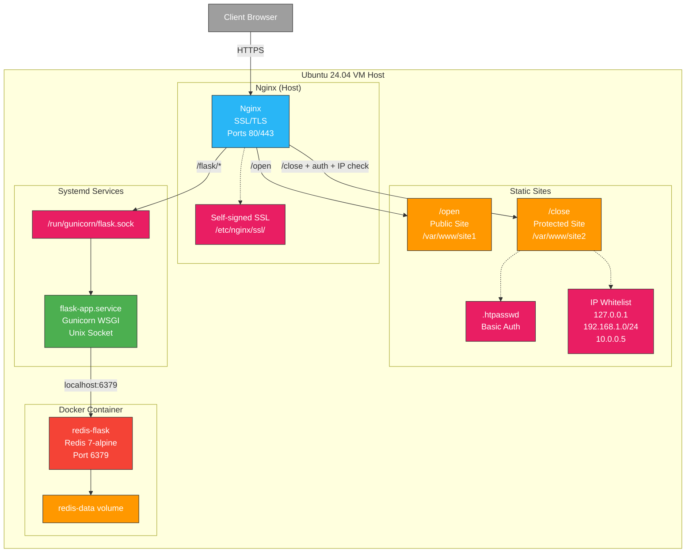

# Flask API with JWT Authentication - Production Setup

Production-ready Flask application deployed on Ubuntu 24.04 VM with Nginx reverse proxy, systemd service management, Redis in Docker, and SSL/TLS encryption.



## 🚀 Access URLs

- **Main Page**: https://37.9.53.237/ (displays all 3 sites in iframes)
- **Public Site**: https://37.9.53.237/open (no authentication required)
- **Protected Site**: https://37.9.53.237/close 
  - Basic Auth: `admin` / `homework`
  - IP Restriction: Only allowed from 127.0.0.1, 192.168.1.0/24, 10.0.0.5
- **Flask API**: https://37.9.53.237/flask/
- **Swagger UI**: https://37.9.53.237/flask/swagger/

## 📁 Project Structure

```
/home/ubuntu/
├── Flask-app/                    # Main application directory
│   ├── src/                      # Source code
│   │   ├── app/
│   │   │   ├── __init__.py      # Flask app factory
│   │   │   ├── config.py        # Configuration
│   │   │   ├── extensions.py    # Redis client
│   │   │   ├── api/             # API routes
│   │   │   │   └── routes.py    # /ping, /count endpoints
│   │   │   ├── auth/            # Authentication
│   │   │   │   ├── decorators.py # JWT decorator
│   │   │   │   └── routes.py    # /login endpoint
│   │   │   └── swagger_ui.py    # Custom Swagger UI
│   │   ├── run.py               # Entry point
│   │   └── requirements.txt     # Dependencies
│   └── compose/                 # Docker configurations

/etc/nginx/
├── sites-available/
│   └── homework                 # Nginx configuration
└── ssl/
    ├── homework.crt             # SSL certificate
    └── homework.key             # SSL private key

/etc/systemd/system/
└── flask-app.service            # Systemd service

/var/www/
├── main/                        # Main landing page with 3 iframes
│   └── index.html              # Shows all sites in one view
├── site1/                       # Public site (/open)
│   └── index.html
└── site2/                       # Protected site (/close)
    └── index.html

/run/gunicorn/
└── flask.sock                   # Unix socket (created at runtime)
```

## 🔧 System Components

### 1. **Nginx (Host)**
- Installed directly on Ubuntu (not Docker)
- Handles SSL/TLS termination
- Serves static sites
- Reverse proxy for Flask via Unix socket
- Basic authentication for /close
- IP-based access control for /close
- Separate access/error logs for each location

### 2. **Flask Application (Systemd)**
- Runs as systemd service `flask-app.service`
- Gunicorn WSGI server with 4 workers
- Unix socket communication at `/run/gunicorn/flask.sock`
- JWT authentication
- Swagger documentation

### 3. **Redis (Docker)**
- Container name: `redis-flask`
- Persistent volume: `flask-app_redis-data`
- Used for visit counter

## 📋 API Endpoints

### Public Endpoints
- `GET /flask/api/ping` - Health check
  ```bash
  curl -k https://37.9.53.237/flask/api/ping
  # Response: {"status": "ok"}
  ```

- `POST /flask/auth/login` - Get JWT token
  ```bash
  curl -k -X POST https://37.9.53.237/flask/auth/login \
    -H "Content-Type: application/json" \
    -d '{"username":"admin","password":"password"}'
  # Response: {"token": "eyJhbGciOiJIUzI1NiIs..."}
  ```

### Protected Endpoints (require JWT)
- `GET /flask/api/count` - Visit counter
  ```bash
  curl -k https://37.9.53.237/flask/api/count \
    -H "Authorization: Bearer YOUR_TOKEN_HERE"
  # Response: {"visits": 42}
  ```

## 🛠️ Management Commands

### Service Management
```bash
# Flask service
sudo systemctl status flask-app
sudo systemctl start flask-app
sudo systemctl stop flask-app
sudo systemctl restart flask-app
sudo journalctl -u flask-app -f  # View logs

# Nginx service
sudo systemctl status nginx
sudo systemctl reload nginx
sudo nginx -t  # Test configuration

# Redis container
docker start redis-flask
docker stop redis-flask
docker logs redis-flask
docker exec -it redis-flask redis-cli
```

### Quick Status Check
```bash
# Custom command to check all services
check-flask

# Check IP restrictions
curl -I https://localhost/close/ -u admin:admin -k # Should work from localhost
# From external IP will return 403 Forbidden
```

### Quick Restart
```bash
# Custom command to restart Flask
restart-flask
```

## 🔐 Security Configuration

### SSL/TLS
- Self-signed certificate at `/etc/nginx/ssl/`
- Force redirect HTTP → HTTPS
- Certificate warning expected (self-signed)

### Authentication
- JWT tokens for API (secret in environment)
- Basic auth for /close site (user: admin, pass: admin)

### IP Restrictions
- `/close` location restricted to:
  - 127.0.0.1 (localhost)
  - 192.168.1.0/24 (local network example)
  - 10.0.0.5 (specific IP example)
  - All other IPs receive 403 Forbidden

### Firewall
```bash
# Current rules
sudo ufw status
# Allows: 22/tcp, 80/tcp, 443/tcp
```

## 📊 Monitoring Options

### Add Prometheus & Grafana (optional)
```bash
# Quick setup
docker run -d --name prometheus -p 9090:9090 prom/prometheus
docker run -d --name grafana -p 3000:3000 grafana/grafana

# Access at:
# Prometheus: http://37.9.53.237:9090
# Grafana: http://37.9.53.237:3000
```

### View Logs
```bash
# Nginx access logs (separate for each site)
tail -f /var/log/nginx/main_access.log      # Main page
tail -f /var/log/nginx/site1_access.log     # /open site
tail -f /var/log/nginx/site2_access.log     # /close site
tail -f /var/log/nginx/flask_access.log     # Flask API

# Flask application logs
sudo journalctl -u flask-app -f

# Redis logs
docker logs -f redis-flask
```

## 🚨 Troubleshooting

### Common Issues

1. **502 Bad Gateway**
   ```bash
   # Check Flask service
   sudo systemctl status flask-app
   # Check socket permissions
   ls -la /run/gunicorn/
   ```

2. **Redis Connection Error**
   ```bash
   # Check Redis container
   docker ps | grep redis
   docker start redis-flask
   ```

3. **JWT Token Invalid**
   ```bash
   # Token expires after 1 hour
   # Get new token via /flask/auth/login
   ```

4. **403 Forbidden on /close**
   ```bash
   # Check if your IP is allowed in nginx config
   sudo grep -A5 "location /close" /etc/nginx/sites-available/homework
   # Add your IP if needed and reload nginx
   ```

### Health Checks
```bash
# Check all components
curl -k https://localhost/flask/api/ping  # Flask
docker exec redis-flask redis-cli ping     # Redis
sudo nginx -t                              # Nginx config
```

## 🔄 Deployment Updates

### Update Flask Application
```bash
cd ~/Flask-app
git pull  # If using git
sudo systemctl restart flask-app
```

### Update Static Sites
```bash
# Edit files directly
sudo nano /var/www/site1/index.html
sudo nano /var/www/site2/index.html
# Changes apply immediately
```

### Add IP to Protected Site Access
```bash
# Edit nginx config
sudo nano /etc/nginx/sites-available/homework

# Find location /close and add your IP:
# allow YOUR.IP.HERE;

# Test and reload
sudo nginx -t
sudo systemctl reload nginx
```

### SSL Certificate Renewal
```bash
# Generate new self-signed cert
sudo openssl req -x509 -nodes -days 365 -newkey rsa:2048 \
  -keyout /etc/nginx/ssl/homework.key \
  -out /etc/nginx/ssl/homework.crt

sudo systemctl reload nginx
```

## 🌐 Environment Variables

Located in `/home/ubuntu/Flask-app/.env`:
```bash
FLASK_APP=run.py
FLASK_ENV=production
SECRET_KEY=your-secret-key-here
REDIS_URL=redis://localhost:6379/0
```

## 📈 Performance

- **Gunicorn Workers**: 4 (2 × CPU cores + 1)
- **Unix Socket**: ~10-20% faster than TCP
- **Nginx Caching**: Enabled for static content
- **Gzip Compression**: Enabled for text content

## 🧪 Testing

### Full API Test
```bash
# 1. Get token
TOKEN=$(curl -k -s -X POST https://37.9.53.237/flask/auth/login \
  -H "Content-Type: application/json" \
  -d '{"username":"admin","password":"password"}' | jq -r .token)

# 2. Test protected endpoint
curl -k https://37.9.53.237/flask/api/count \
  -H "Authorization: Bearer $TOKEN"

# 3. Test multiple times
for i in {1..5}; do
  curl -k https://37.9.53.237/flask/api/count \
    -H "Authorization: Bearer $TOKEN"
  echo
done
```

## 📝 Notes

- This is a production-ready setup with full security features
- Main page displays all three sites in iframes for easy access
- IP restrictions implemented for administrative areas
- Separate logging for each site component
- Database persistence via Docker volume
- Logs rotated automatically by systemd and logrotate
- For high availability, consider multiple VMs with load balancer