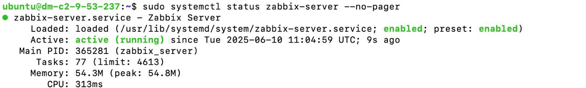
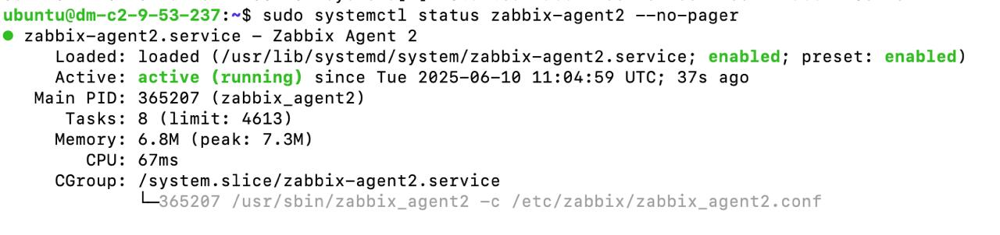
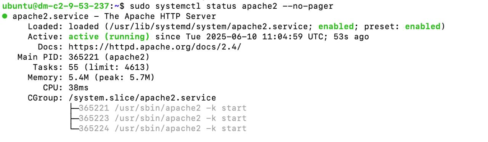
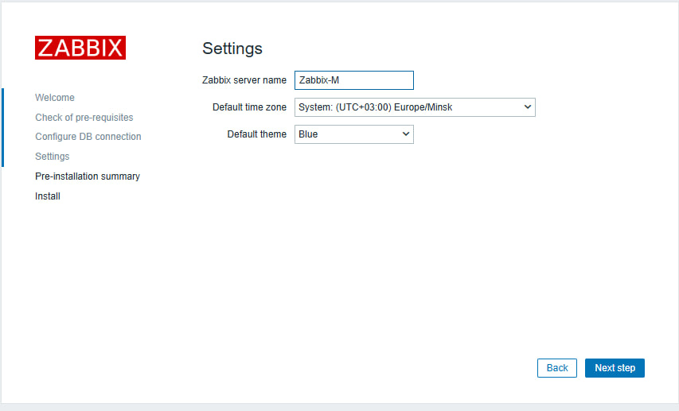
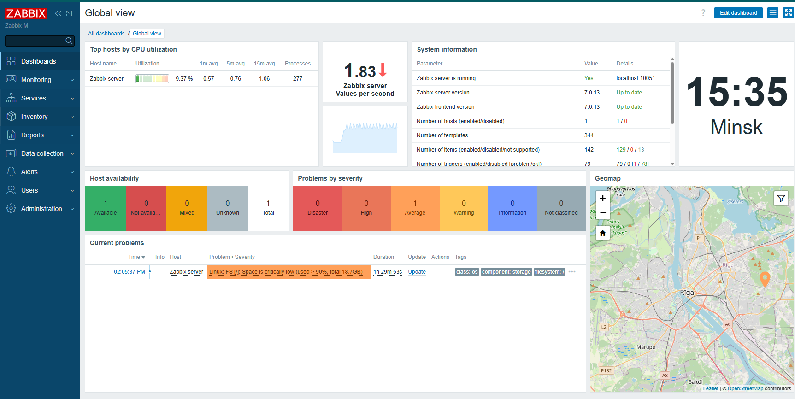
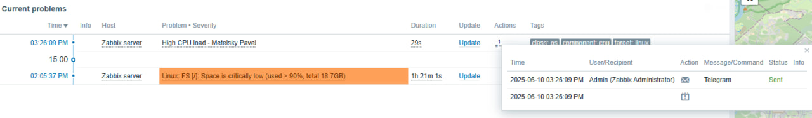
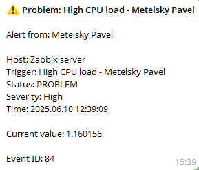

# Отчет по домашнему заданию к лекции 9. Мониторинг

**Выполнил:** Метельский Павел  
**Дата выполнения:** 10 июня 2025  
**Сервер:** Ubuntu 24.04.1 LTS (37.9.53.237)

- **Репозиторий с кодом:** https://github.com/PavelMetelsky/HW-lesta/tree/master/hw-Zabbix

## Задание: Установка и настройка Zabbix с отправкой уведомлений в Telegram

### 1. Установка Zabbix Server, Frontend и базы данных

#### 1.1 Установка репозитория и компонентов

```bash
# Установка Zabbix репозитория
wget https://repo.zabbix.com/zabbix/7.0/ubuntu/pool/main/z/zabbix-release/zabbix-release_7.0-2+ubuntu24.04_all.deb
sudo dpkg -i zabbix-release_7.0-2+ubuntu24.04_all.deb
sudo apt update

# Установка всех компонентов
sudo apt install -y zabbix-server-mysql zabbix-frontend-php zabbix-apache-conf zabbix-sql-scripts zabbix-agent2 mysql-server apache2
```

#### 1.2 Настройка базы данных MySQL

```bash
# Создание базы данных и пользователя
sudo mysql << 'EOF'
DROP DATABASE IF EXISTS zabbix;
CREATE DATABASE zabbix CHARACTER SET utf8mb4 COLLATE utf8mb4_bin;
DROP USER IF EXISTS 'zabbix'@'localhost';
CREATE USER 'zabbix'@'localhost' IDENTIFIED BY 'ZabbixDBPass123!';
GRANT ALL PRIVILEGES ON zabbix.* TO 'zabbix'@'localhost';
SET GLOBAL log_bin_trust_function_creators = 1;
FLUSH PRIVILEGES;
EOF

# Импорт схемы базы данных
zcat /usr/share/zabbix-sql-scripts/mysql/server.sql.gz | mysql --default-character-set=utf8mb4 -uzabbix -pZabbixDBPass123! zabbix
```

#### 1.3 Конфигурация Zabbix Server

```bash
# Настройка пароля базы данных
sudo sed -i 's/# DBPassword=/DBPassword=ZabbixDBPass123!/g' /etc/zabbix/zabbix_server.conf

# Добавление пути для alertscripts
echo "AlertScriptsPath=/usr/lib/zabbix/alertscripts" | sudo tee -a /etc/zabbix/zabbix_server.conf
```

#### 1.4 Настройка PHP и Apache

```bash
# Переключение Apache MPM
sudo a2dismod mpm_event
sudo a2enmod mpm_prefork
sudo a2enmod php8.3

# Настройка PHP
PHP_INI="/etc/php/8.3/apache2/php.ini"
sudo sed -i 's/^max_execution_time.*/max_execution_time = 300/' $PHP_INI
sudo sed -i 's/^memory_limit.*/memory_limit = 128M/' $PHP_INI
sudo sed -i 's/^post_max_size.*/post_max_size = 16M/' $PHP_INI
sudo sed -i 's/^upload_max_filesize.*/upload_max_filesize = 2M/' $PHP_INI
sudo sed -i 's/^max_input_time.*/max_input_time = 300/' $PHP_INI
sudo sed -i 's/^;date.timezone.*/date.timezone = Europe\/Minsk/' $PHP_INI

# Включение конфигурации Zabbix
sudo a2enconf zabbix
```

### 2. Установка и настройка Zabbix Agent

```bash
# Конфигурация агента для локального мониторинга
sudo cat > /etc/zabbix/zabbix_agent2.conf << 'EOF'
PidFile=/run/zabbix/zabbix_agent2.pid
LogFile=/var/log/zabbix/zabbix_agent2.log
LogFileSize=0
Server=127.0.0.1
ServerActive=127.0.0.1
Hostname=Zabbix server
Include=/etc/zabbix/zabbix_agent2.d/*.conf
ControlSocket=/tmp/agent.sock
EOF
```

### 3. Создание скрипта для отправки уведомлений в Telegram

```bash
# Создание директории и скрипта
sudo mkdir -p /usr/lib/zabbix/alertscripts

sudo tee /usr/lib/zabbix/alertscripts/telegram.sh << 'EOF' > /dev/null
#!/bin/bash

# Telegram bot settings
BOT_TOKEN="7616687279:AAGpLoBW6Yx24FuVt0bDqi1-tcxS_o62tlE"
CHAT_ID="-4810009303"

# Script parameters
TO="$1"
SUBJECT="$2"
MESSAGE="$3"

# Send message to Telegram
curl -s -X POST "https://api.telegram.org/bot${BOT_TOKEN}/sendMessage" \
     -d "chat_id=${CHAT_ID}" \
     -d "parse_mode=HTML" \
     -d "text=<b>${SUBJECT}</b>%0A%0A${MESSAGE}"
EOF

# Установка прав
sudo chmod +x /usr/lib/zabbix/alertscripts/telegram.sh
sudo chown -R zabbix:zabbix /usr/lib/zabbix/alertscripts
```

### 4. Запуск сервисов

```bash
# Запуск и включение автозапуска
sudo systemctl restart zabbix-server zabbix-agent2 apache2
sudo systemctl enable zabbix-server zabbix-agent2 apache2

# Проверка статуса
sudo systemctl status zabbix-server
```




### 5. Настройка через веб-интерфейс


После установки был выполнен начальный setup wizard через веб-интерфейс:
- URL: http://37.9.53.237/zabbix
- Database password: ZabbixDBPass123!
- Timezone: Europe/Minsk

Креды(Admin/zabbix)



#### 5.1 Создание Media Type для Telegram

**Alerts → Media types → Create media type**
- Name: Telegram
- Type: Script
- Script name: telegram.sh
- Script parameters:
  - {ALERT.SENDTO}
  - {ALERT.SUBJECT}
  - {ALERT.MESSAGE}
- Enabled: ✓

#### 5.2 Настройка Media для пользователя Admin

**Users → Admin → Media → Add**
- Type: Telegram
- Send to: -4810009303
- When active: 1-7,00:00-24:00
- Use if severity: All

#### 5.3 Создание Item для мониторинга CPU

Item для CPU load уже существовал в системе:
- Key: system.cpu.load[all,avg1]
- Type: Zabbix agent

Проверка работы item:
```bash
sudo -u zabbix zabbix_agent2 -t 'system.cpu.load[all,avg1]'
# system.cpu.load[all,avg1]                     [s|0.704590]
```

#### 5.4 Создание триггера

**Data collection → Hosts → Zabbix server → Triggers → Create trigger**
- Name: High CPU load - Metelsky Pavel
- Severity: High
- Expression: last(/Zabbix server/system.cpu.load[all,avg1])>0.7

#### 5.5 Создание Action

**Alerts → Actions → Trigger actions → Create action**
- Name: Telegram Alert - Metelsky
- Enabled: ✓
- Conditions: Trigger severity >= High
- Operations:
  - Send to users: Admin
  - Send only to: Telegram
  - Custom message: ✓

Subject:
```
⚠️ Problem: {EVENT.NAME}
```

Message:
```
Alert from: Metelsky Pavel

Host: {HOST.NAME}
Trigger: {TRIGGER.NAME}
Status: {TRIGGER.STATUS}
Severity: {TRIGGER.SEVERITY}
Time: {EVENT.DATE} {EVENT.TIME}

Current value: {ITEM.VALUE}

Event ID: {EVENT.ID}
```

### 6. Тестирование

Для имитации высокой нагрузки был создан скрипт:

```bash
cat > ~/cpu_stress.sh << 'EOF'
#!/bin/bash
echo "Starting CPU stress test for 2 minutes..."
echo "This will trigger Zabbix alert"
stress --cpu 4 --timeout 120s &
echo "Monitoring CPU load..."
while pgrep stress > /dev/null; do
    echo -n "Current load average: "
    uptime | awk -F'load average:' '{print $2}'
    sleep 5
done
echo "Stress test completed"
EOF

chmod +x ~/cpu_stress.sh
```

Установка инструмента stress:
```bash
sudo apt install -y stress
```

### 7. Результаты

#### 7.1 Срабатывание триггера

При запуске `~/cpu_stress.sh` нагрузка на CPU превысила установленный порог 0.7:



- **Time**: 03:26:09 PM
- **Problem**: High CPU load - Metelsky Pavel  
- **Host**: Zabbix server
- **Duration**: 29s
- **Status**: Update

#### 7.2 Отправка уведомления в Telegram



### 8. Архитектура решения

```
┌─────────────────┐
│   Zabbix Web    │ 
│   Interface     │
│  (37.9.53.237)  │
└────────┬────────┘
         │
┌────────▼────────┐
│  Zabbix Server  │
│   + MySQL DB    │
│   + Apache2     │
└────────┬────────┘
         │
┌────────▼────────┐     ┌──────────────┐
│  Zabbix Agent2  │────▶│ Monitoring   │
│  (localhost)    │     │ CPU, Memory  │
└─────────────────┘     └──────────────┘
         │
         │ Alert triggered
         ▼
┌─────────────────┐     ┌──────────────┐
│ Alert Scripts   │────▶│  Telegram    │
│ telegram.sh     │     │  Bot API     │
└─────────────────┘     └──────────────┘
```

### 9. Используемые компоненты

- **Zabbix Server**: 7.0.13
- **MySQL**: для хранения данных
- **Apache2**: веб-сервер для frontend
- **PHP 8.3**: для работы веб-интерфейса
- **Zabbix Agent2**: для сбора метрик
- **Telegram Bot**: для отправки уведомлений

### 10. Основные команды для управления

```bash
# Проверка статуса сервисов
sudo systemctl status zabbix-server
sudo systemctl status zabbix-agent2

# Просмотр логов
sudo tail -f /var/log/zabbix/zabbix_server.log
sudo tail -f /var/log/zabbix/zabbix_agent2.log

# Тестирование telegram скрипта
sudo -u zabbix /usr/lib/zabbix/alertscripts/telegram.sh "test" "Test" "Message"

# Проверка метрик агента
sudo -u zabbix zabbix_agent2 -t 'system.cpu.load[all,avg1]'

# Старт стресс теста
~/cpu_stress.sh
```
